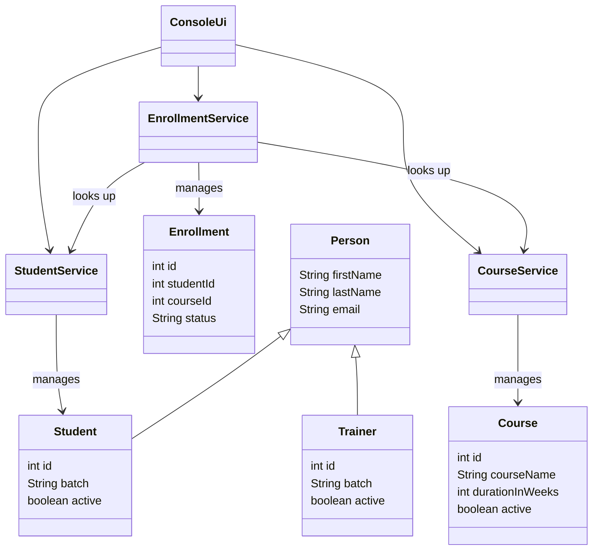

# LearnTrack

A console-based Student & Course Management System written in Core Java. LearnTrack lets an admin manage students, courses, and enrollments entirely from a menu-driven terminal application, using in-memory collections (no database, no external dependencies).

## Features

**Student Management**
- Add a new student
- View all students
- Search for a student by ID
- Deactivate a student

**Course Management**
- Add a new course
- View all courses
- Activate / deactivate a course

**Enrollment Management**
- Enroll a student in a course
- View a student's enrollment
- Mark an enrollment as completed / cancelled

## Project Structure

```
com.airtribe.learntrack/
├── Main.java                  # Application entry point — runs the menu loop
├── entity/                    # Data classes
│   ├── Person.java            # Base class: firstName, lastName, email
│   ├── Student.java           # extends Person — id, batch, active
│   ├── Trainer.java           # extends Person — id, batch, active
│   ├── Course.java            # id, courseName, description, durationInWeeks, active
│   └── Enrollment.java        # id, studentId, courseId, enrollmentDate, status
├── service/                   # Business logic, one service per entity
│   ├── StudentService.java
│   ├── CourseService.java
│   └── EnrollmentService.java
├── ui/
│   └── ConsoleUi.java          # Menu rendering + input handling, delegates to services
├── exception/
│   ├── EntityNotFoundException.java
│   └── EntityNotActiveException.java
└── util/
    └── IdGenerator.java        # Static ID counters for students/courses/enrollments
```

## Class Diagram



## Getting Started

### Prerequisites

- JDK 17 or newer (see [`docs/Setup_Instructions.md`](docs/Setup_Instructions.md) for install steps and version verification).

### Compile

From the repository root:

```bash
javac -d out $(find com.airtribe.learntrack -name "*.java")
```

### Run

```bash
java -cp out Main
```

You'll be dropped into the main menu — enter a number and press Enter to pick an option, and `11` to exit.

## Documentation

- [`docs/Setup_Instructions.md`](docs/Setup_Instructions.md) — JDK version, install steps, "Hello World" sanity check.
- [`docs/JVM_Basics.md`](docs/JVM_Basics.md) — JDK vs JRE vs JVM, bytecode, "write once, run anywhere."
- [`docs/Design_Notes.md`](docs/Design_Notes.md) — why `ArrayList` over arrays, where/why static members are used, where inheritance is used, and an honest list of known limitations in the current implementation.