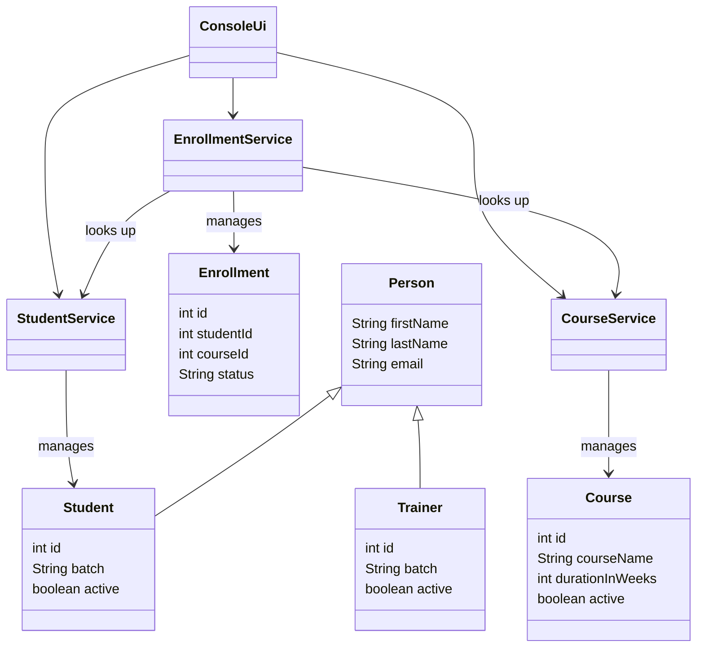

# LearnTrack

LearnTrack is a console based Student and Course Management System built in core Java. An admin can add students, add courses, and enroll students in courses, all from a simple text menu. Everything is stored in memory while the program runs. There is no database.

## Features

Student Management
- Add a new student
- View all students
- Search for a student by ID
- Deactivate a student

Course Management
- Add a new course
- View all courses
- Activate or deactivate a course

Enrollment Management
- Enroll a student in a course
- View a student's enrollment
- Mark an enrollment as completed or cancelled

## Project Structure

```
com.airtribe.learntrack/
├── Main.java              # starts the program and runs the menu loop
├── entity/                # the data classes
│   ├── Person.java        # base class with firstName, lastName, email
│   ├── Student.java       # extends Person, adds id, batch, active
│   ├── Trainer.java       # extends Person, adds id, batch, active
│   ├── Course.java        # id, courseName, description, durationInWeeks, active
│   └── Enrollment.java    # id, studentId, courseId, enrollmentDate, status
├── service/                # the logic for each entity
│   ├── StudentService.java
│   ├── CourseService.java
│   └── EnrollmentService.java
├── ui/
│   └── ConsoleUi.java       # shows the menu, reads input, calls the services
├── exception/
│   ├── EntityNotFoundException.java
│   └── EntityNotActiveException.java
└── util/
    └── IdGenerator.java     # gives out the next id for students, courses, enrollments
```

## Class Diagram



## Getting Started

### What you need

JDK 17 or newer. See [`docs/Setup_Instructions.md`](docs/Setup_Instructions.md) for how to check and install it.

### Compile

From the project root, run:

```bash
javac -d out $(find com.airtribe.learntrack -name "*.java")
```

### Run

```bash
java -cp out Main
```

Type a number and press Enter to pick a menu option. Type `11` to exit.

## Documentation

- [`docs/Setup_Instructions.md`](docs/Setup_Instructions.md) - JDK version, install steps, and a Hello World check.
- [`docs/JVM_Basics.md`](docs/JVM_Basics.md) - what JDK, JRE, and JVM mean, what bytecode is, and what "write once, run anywhere" means.
- [`docs/Design_Notes.md`](docs/Design_Notes.md) - why I used ArrayList, where I used static fields and why, and where I used inheritance.
